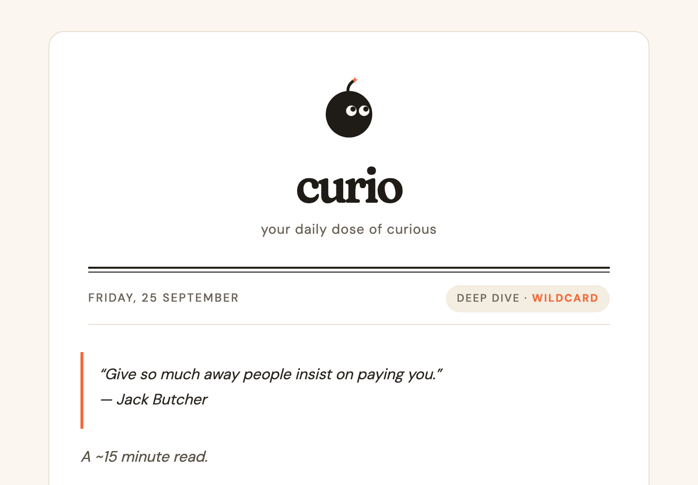

<p align="center">
  
</p>

<h1 align="center">Curio</h1>

<p align="center">
  <em>Your daily dose of curious.</em><br/>
  A personal daily content digest, curated by Claude.
</p>

<p align="center">
  
</p>

---

Curio is a small Python app that runs once a day on your machine (or an always-on box). It fetches candidates from your favourite sources, filters them through **your** taste profile using Claude, respects diversity constraints so you don't get filter-bubbled, and mails the result to your inbox in a ~15-minute read.

It is opinionated by default but built to be forked and tuned.

---

## What's inside each edition

- **A quote of the day** — curated daily rotation via [ZenQuotes](https://zenquotes.io)
- **World & tech news** — via Claude's `WebSearch`, shaped by your interests
- **Hacker News** — top stories filtered against your taste
- **Paper of the day** — recent arXiv paper from your interest categories
- **Deep dive** — a longer read; the topic rotates by weekday (systems Mon, healthcare Tue, AI Wed, data infra Thu, wildcard Fri, retrospective Sat, light + review Sun)
- **Fact of the day** — tied to today's date via Wikipedia "on this day"
- **Comic** — rotates through XKCD / SMBC / The Oatmeal

Structural guarantees:
- Per-source cap (nothing floods the edition)
- Per-topic cap (~30% max)
- ~20% exploration slots (items outside your top-scoring categories) — no filter bubble
- Novelty check (won't repeat yesterday's stories via URL + fuzzy title match)

Every include/exclude decision is logged with a reason so you can review what the agent thought.

## How it works

```
             ┌──── WebSearch (news, venue papers)
             │
Fetchers ────┼──── HN Firebase API
             ├──── arXiv API
             ├──── Wikipedia "on this day"
             ├──── XKCD / SMBC / Oatmeal
             └──── ZenQuotes
                        │
                        ▼
              compute_novelty (rapidfuzz + URL dedup)
                        │
                        ▼
   ┌─── Claude Agent SDK ────────────────────────────┐
   │  reads taste.yaml, applies interests +          │
   │  anti-interests + calibration + novelty +       │
   │  structural constraints → picks items,          │
   │  writes summaries + a content-derived subject   │
   └─────────────────────────────────────────────────┘
                        │
                        ▼
      render (jinja2 + markdown) → styled HTML
                        │
                        ▼
             Resend HTTP API → your inbox
```

The agent is orchestrated via the [Claude Agent SDK](https://docs.anthropic.com/en/api/agent-sdk) and picks up your Claude subscription/API credentials from the environment automatically.

## Setup

### Prerequisites

- Python 3.11+
- [`uv`](https://docs.astral.sh/uv/) for dependency management
- A [Claude](https://claude.ai) subscription or API key (SDK auto-detects)
- A [Resend](https://resend.com) account (free tier: 3,000 emails/month)
- A domain you can add DNS records to (for the from-address)

### 1. Clone and install

```bash
git clone https://github.com/arpit94/curio.git
cd curio
uv sync
```

### 2. Configure Resend

1. Sign up at [resend.com](https://resend.com)
2. **Domains → Add Domain →** enter your domain
3. Add the DNS records Resend gives you (usually 3 TXT + 1 MX for DKIM/SPF/feedback)
4. Wait for verification (minutes-hours)
5. **API Keys → Create API Key** with **Sending access** scope

### 3. Set up `.env`

```bash
cp .env.example .env
```

Edit `.env`:

```env
RESEND_API_KEY=re_xxxxxxxxxxxxxxxxxxxxxxxx
DIGEST_FROM=curio@yourdomain.com   # any prefix on your verified domain
DIGEST_TO=you@wherever.com          # where you want it delivered
DIGEST_FROM_NAME=Curio              # optional; defaults to "Curio"
```

### 4. Tune `config/taste.yaml` to your interests

This is the single most important file. It's the affinity model Claude uses to decide what's for you. Ships with sensible defaults but should be edited to your actual interests before you rely on the output.

```yaml
interests:
  - name: your_topic
    weight: 1.0
    keywords: [term1, term2, ...]

anti_interests:
  - crypto_pumps
  - celebrity_gossip
  - product_launch_fluff

calibration:
  include_like:
    - "Example of a headline you'd want to see"
  exclude_like:
    - "Example of noise you don't want"
```

The `include_like` / `exclude_like` calibration examples are few-shot signals to Claude — the more specific, the better the filter.

### 5. Test

```bash
uv run curio --mode dry-run   # runs the whole flow, does NOT send
uv run curio --mode daily     # runs and actually sends via Resend
```

Check your inbox. First send may land in spam until Resend has a warm-up history — mark as "not spam" and future ones stay in primary.

### 6. Schedule

Copy the crontab example and edit for your paths:

```bash
crontab -e
# paste from scripts/crontab.example
```

If you're on macOS and want your Mac to wake for the job:

```bash
sudo pmset repeat wake MTWRFSU 05:55:00
```

## Customization

- **`config/taste.yaml`** — your interests, anti-interests, calibration examples, novelty threshold
- **`config/sources.yaml`** — weekday deep-dive rotation, per-segment counts, structural caps
- **`config/settings.yaml`** — model choice, max turns, permission mode
- **`templates/edition.html.j2`** — the email design; ship your own brand + palette
- **`assets/mark.png`** + **`assets/mark.svg`** — logo (swap for your own; used as base64 data URI so it renders in Gmail)
- **`src/curio/agent.py`** — `DAILY_PROMPT` describes the process end-to-end; edit to change segments, format, or tone
- **`src/curio/sources/`** — add a new source by dropping a module with an async fetcher and registering it as a `@tool` in `src/curio/mcp_servers/curio_tools.py`

## Modes

- `daily` — normal edition (Mon-Sat)
- `sunday-review` — daily edition + a weekly review section that reads the last 7 days' logs and proposes edits to `taste.yaml`
- `dry-run` — same as daily but no email actually sent (agent still calls `send_email`; the tool honors `CURIO_DRY_RUN=1` as a no-op)

## Cost

Per run: roughly $1-2 in Claude usage (varies by tool use and content depth). Resend is free at 1 email/day.

At current pricing, ~$40/month for daily runs. You can bring it down by choosing a smaller model (edit `config/settings.yaml`).

## Design system

Curio's visual language is intentionally warm and editorial. Design tokens (in `templates/edition.html.j2`):

| Token | Hex | Use |
|---|---|---|
| Ink | `#1F1B16` | Body text, mark head |
| Spark | `#F26B3A` | Accent, links, "why it matters" |
| Oat | `#F4EDE1` | Pills, footer band |
| Paper | `#FBF7F0` | Outer background |

Fonts: [Fraunces](https://fonts.google.com/specimen/Fraunces) (headings + wordmark) + [DM Sans](https://fonts.google.com/specimen/DM+Sans) (body), served via Google Fonts.

## Contributing

This is a personal tool built for a specific taste, but the architecture is designed to be forked. If you build something on top of it — new sources, alternative delivery, a different brand — I'd love to hear about it.

## License

MIT — see [LICENSE](LICENSE).
